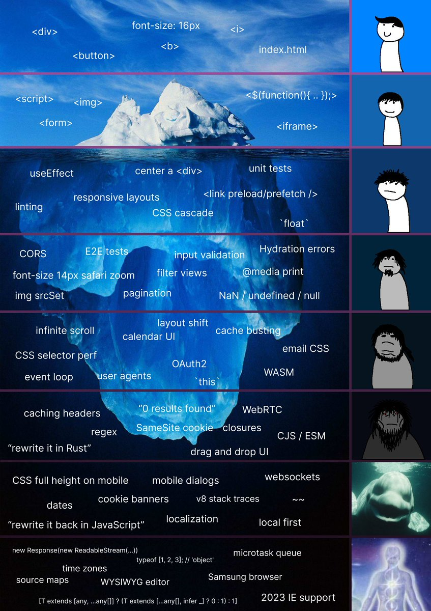

# Agenda

> ***NOTE:** This agenda is copied from the previous term and needs to be adjusted to this semester. Otherwise, the topics are generally in the correct order.*

> These are my notes on what I plan to teach in each [**upcoming class**](#apr-07-w13).
>
> ###### *... Warn those who are idle ..., encourage the disheartened, help the weak, be patient with everyone.*
>
> > My philosophy of teaching, taken from [the source](https://www.bible.com/bible/111/1TH.5.14.NIV)


> ## Starter Kits
>
> To grab a starting point for any in-class demos or practices, you can use [**tiged**](https://github.com/tiged/tiged) (based on [`degit`](https://github.com/Rich-Harris/degit) by Rich Harris, creator of Svelte). It will allow you to grab a copy of the starter kit folder to put into your student workbook.
> 
> You will need to have `pnpm` installed and working on your computer. Run the following code in the terminal from the **root** of your repository:
>
> ```bash
> pnpm dlx tiged --disable-cache --force dgilleland/CPSC-1520-Workbook/sk/-how-to- ./src/-how-to-
> ```
>
> ***Note:** You may need to <kbd>ctrl</kbd>+<kbd>c</kbd> to stop the `pnpm tlx tiged` command after it has finished downloading the demo folder.*

<!--

    ```ps
    pnpm dlx tiged --disable-cache --force CPSC-1520/DanG-A05-CPSC-1520-Instructor-Workbook-2025-Jan/sk/Demo-0 ./src/0xx/ad-hoc-demo
    ```


-->

----

## Jan-Apr 2025 Schedule

### Jan 8 (W01)

- **Today** *(Online)*
  - Course Introduction
  - GitHub Account Setup
  - Software Setup

### Jan 9

- *Announcements:*
  - A week from today is **In-Class Lab 1**
  - A week from tomorrow is the cutoff for **Quiz 1**
- Workbook Setup
  - [000](./src/000/ReadMe.md)
  - [001](./src/001-StartHere/ReadMe.md)
- **Homework**
  - Complete the lesson for [002](./src/002/ReadMe.md)
  - Complete the [Practice Version Control](https://dgilleland.github.io/CPSC-1520/tutorials/0020/) tutorial
  - In your student workbook, review the Reading Lists: `~/docs/Readings.md`

----

## Jan 13 (W02)

- **Announcements**
  - **Quiz Readings** - Links for readings for individual quizzes can be found under the individual topics that the quizzes relate to. For convenience, I have posted a [*Summary of Quiz Readings*](./docs/QuizReadings.md). 
  - **Brightspace Content** - Topics on Brightspace were in the wrong order at the start of the term. The order has been corrected.
- **Today**
  - Practice Assignment (see Brightspace)
  - [003](./src/003/ReadMe.md) Intro to JavaScript
- **Homework**
  - Tutorial: [Querying the DOM](https://dgilleland.github.io/CPSC-1520/tutorials/0030/)
    - Put it in your student workbook under `~/src/query-dom/`
  - Tutorial: [Using Script Tags](https://dgilleland.github.io/CPSC-1520/tutorials/0040/)
    - Put it in your student workbook under `~/src/script-tags/`
    - Bookmark and read the official documentation on [Semantic HTML](https://developer.mozilla.org/en-US/curriculum/core/semantic-html/)

## Jan 15

- **Today** *(Online)*
  - [ ] [Update the **Practice Assignment**](https://dgilleland.github.io/CPSC-1520/guides/lab-updates/) for the latest automated tests.
  - [ ] ***Feedback:*** Did you do the two tutorials from last class??!
  - [ ] **Demo:** Combine the main points of [003](./src/003/ReadMe.md) and [004](./src/004/ReadMe.md)
    - Find and modify DOM elements with `document.querySelector()`
    - Link a JavaScript file
    - Create and use variables
- **Homework**
  - *Reminder to keep up with Quiz readings and completing the quizzes before their cutoff date.*
  - [ ] Review the [003 LOGs](./src/003/LOGs.md) and the [004 LOGs](./src/004/LOGs.md)
  - [ ] Read the following articles:
    - [Why JavaScript?](https://dgilleland.github.io/CPSC-1520/explanations/0010/)
    - [JavaScript as a Language](https://dgilleland.github.io/CPSC-1520/explanations/0020/)


## Jan 16

- **Today**
  - [x] Lab 1 released/due **today**
    - **20-30 minutes** of class time to complete the lab.
  - [ ] *What is a Computer Program?*
  - [ ] Begin [005](./src/005/ReadMe.md)
    1. Launch the `005/live-demo/index.html` in Live Server.
    2. Open the Dev Tools Console.
    3. Walk through 005's ReadMe.md
  - [ ] The browser's dev tools provides a **console** that is a REPL (Read-Eval-Print-Loop) environment for JavaScript
  - [ ] Node also provides/is a REPL for JavaScript

----

## Jan 20 (W03)

- **Today**
  - [ ] Continue [**005**](./src/005/ReadMe.md)
    1. Launch the `005/live-demo/index.html` in Live Server.
    2. Open the Dev Tools Console.
    3. Walk through 005's ReadMe.md
       - numbers vs. strings
       - math vs. concatenation
       - variables
       - strings to numbers - `.parseInt()` and `.parseFloat()`
       - numbers to strings - `.toString()` and `.toFixed()`
    4. Note the difference between `let` and `const` in creating variables
    5. Emphasize difference between primitive (built-in) types and objects
    6. Mention [the LOGs](./src/005/LOGs.md) (*Learning Outcome Guides*)
  - [ ] Characteristics of JavaScript
    - case-sensitive
    - dynamically-typed (or *loosely-typed*) language
    - string literals can be wrapped in double or single quotes
    - string interpolation is performed with text inside a pair of back-ticks (`` ` ``)
      - placeholders in the form of `${expression}`
      - e.g.: `` `The count is ${count}` ``
  - [**006**](./src/006/ReadMe.md) (cont.) - Intro to Functions in JavaScript
    - Methods in the global `console` object
      - `.log()`
      - `.clear()`
      - list 3 others from exploring in a REPL
    - `alert()`, `prompt()` and `confirm()` global functions
- **Homework**
  - [ ] Do the [**Learn by Play** portion of the `005/ReadMe.md`](./src/005/ReadMe.md#learn-by-play)
  - [ ] Review the new [Finding DOM Elements](https://dgilleland.github.io/CPSC-1520/guides/0030/) guide.
  - [ ] Review [006 LOGs](./src/006/LOGs.md)


## Jan 22

- **Today** *(Online)*
  - [ ] How to use ***LOGs** (Learning Outcome Guides)*
  - [**007**](./src/007/ReadMe.md) - Creating JavaScript Functions
- **Homework**
  - [ ] Complete [practice in `007`](./src/007/ReadMe.md#practice-agreement)
  - [ ] Review [007 LOGs](./src/007/LOGs.md)
  - [ ] Styling Challenge (CSS only - no JavaScript) - *This is completely optional. I put that in there just for you guys in Web Design and Development, not because it has anything to do with JavaScript, but because I wanted you to try thinking about styling without lots of <div>, <span> and class="" attributes. I figured it would help you with your design journey.*

    ```ps
    pnpm dlx tiged --disable-cache --force CPSC-1520/DanG-A05-CPSC-1520-Instructor-Workbook-2025-Jan/sk/005.5 ./src/005.5
    ```


## Jan 23

- **Today**
  - [ ] Lab 2 released/due **today**
    - **30-45 minutes** of class time to complete the lab.
  - [ ] How to get the [Starter Kits](#starter-kits) for each class.
  - [**008**](./src/008/ReadMe.md) - Form Input and Handling Events
    - A *soft introduction* to Events and Event Handling in web pages.

      ```ps
      pnpm dlx tiged --disable-cache --force CPSC-1520/DanG-A05-CPSC-1520-Instructor-Workbook-2025-Jan/sk/008/soft-intro ./src/008/soft-intro
      ```

- **Homework**
  - [ ] Ensure you have been making notes on all the LOG items in your student workbook and that you have committed and pushed those notes.
  - [ ] Review the code from today's class. Try to describe what each part of the JavaScript code is doing. Identify new items such as mouse events, new DOM object properties, etc.
    - > ***FYI:** Reviewing code from each class should be a regular practice, even when I'm not explicit in it being homework.*

----

## Jan 27 (W04)

- [ ] Housekeeping Tasks:
  - [ ] Version Control: Updating Your Workbook (commit & push)
  - [ ] Filling the Gaps: Self-study is the only way to fill in the gaps between what you do and don't know about HTML.



- **Starter Kits** for the today and the next class
  - The *`demo-classlist`* starter kit is a simple demo for an ad-hoc demo in class

    ```ps
    pnpm dlx tiged --disable-cache --force CPSC-1520/DanG-A05-CPSC-1520-Instructor-Workbook-2025-Jan/sk/Demo-0 ./src/008/demo-classlist
    ```

  - The *`demo-events`* starter kit is an assortment of event handlers; it's mostly a demo where the code is already done.

    ```ps
    pnpm dlx tiged --disable-cache --force CPSC-1520/DanG-A05-CPSC-1520-Instructor-Workbook-2025-Jan/sk/008/demo-events ./src/008/demo-events
    ```

  - The [*Text Manipulation*](./src/008/demo-text-manipulation/ReadMe.md) starter kit is where we can explore event handlers and input controls.

    ```ps
    pnpm dlx tiged --disable-cache --force CPSC-1520/DanG-A05-CPSC-1520-Instructor-Workbook-2025-Jan/sk/008/demo-text-manipulation ./src/008/demo-text-manipulation
    ```

  - The [*Form Processing*](./src/008/form-processing/ReadMe.md) starter kit moves us toward processing all the user input from a `<form>` in a single event handler.

    ```ps
    pnpm dlx tiged --disable-cache --force CPSC-1520/DanG-A05-CPSC-1520-Instructor-Workbook-2025-Jan/sk/008/form-processing ./src/008/form-processing
    ```

- **Today**
  - [**008**](./src/008/ReadMe.md) - Form Input and Handling Events
    - [ ] Complete the [soft-intro](./src/008/soft-intro/ReadMe.md) TODO items
    - [ ] In the ad-hoc [demo-classlist](./src/008/demo-classlist)  we will listen for the click of the `<h1>` and toggle the `hidden` class for the `<output>`
    - [ ] Overall goals:
      - exposure to a few more HTML tags
      - programmatically adding/removing CSS classes from DOM elements
- **Homework**
  - Review the [LOGs](./src/008/LOGs.md)
  - Review the [**html**](./src/008/demo-text-manipulation/index.html) and [**JavaScript**](./src/008/demo-text-manipulation/js/main.js) code for the text manipulation demo
  - Can you...
    - [ ] create an event handler
    - [ ] add an event listener
    - [ ] add and remove CSS classes programmatically (from `.classList`)
    - [ ] use an anonymous handler for an event listener

## Jan 29

- **Today** *(Online)*
  <!-- - [ ] Life Advice: **Don't be *passive*!**
    - *Don't wait for  -->
  - [ ] **(5 min)** - Lab 2 solution
  - [ ] **(15-25 min)** - Review [**demo-events**](./src/008/demo-events/js/main.js) to discuss the various mouse events.
    - [ ] Overall goals:
      - exploring different mouse events
  - [ ] **(10-15 min)** - Ad-hoc exploration of string manipulation functions (based roughly on the event-based intent of [demo-text-manipulation](./src/008/demo-text-manipulation/))
    - **`.length`** property
    - `.trim()` (plus left/right trim), `.toUpperCase()`/`.toLowerCase()`, `.padStart()`/`.padEnd()`, `.repeat()`, `.replace()` + `.replaceAll()`, `.substr()` vs. `.substring()`
    - `.charAt()` and `.charCodeAt()`, `String.fromCharCode()`
    - A sidenote about the short-hand Math operators
      - `+=` et.al., `++` and `--` (prefix vs. postfix)

        ```js
        let count = 1;
        appendLine(`Count starts out as ${count}`);
        appendLine(`Postfix increment: count is ${count++} and then ${count}`);
        appendLine(`Prefix increment: count is ${++count} and then ${count}`);
        ```

    - Starter Kit *(installs to `~/src/005/string-functions/`)*

      ```ps
      pnpm dlx tiged --disable-cache --force CPSC-1520/DanG-A05-CPSC-1520-Instructor-Workbook-2025-Jan/sk/Demo-Steps ./src/005/string-functions
      ```

  - [ ] **(30-40 min)** - [Form processing](./src/008/form-processing/ReadMe.md) - Introduction
    - [ ] Overall goals:
      - `submit` event for forms
      - identifying the form DOM element with the event's `.target` property
      - identifying input controls on the form
- **Homework**
  - [ ] Complete the [Event Listener tutorial](https://dgilleland.github.io/CPSC-1520/tutorials/0070/) and place it in your workbook at **`~/src/008/event-listener/`**
  - [ ] Complete the [DOM Interactions tutorial](https://dgilleland.github.io/CPSC-1520/tutorials/0080/) and place it in your workbook at **`~/src/008/dom-styling/`**
  - [ ] Can you...
    - [ ] identify what is meant by **mouse** events such as `'click'`, `'dblclick'`, **`'mouseover'`**, **`'mouseout'`**, `'mouseenter'`, `'mouseleave'`, `'mousemove'`
    - [ ] perform string manipulations
    - [ ] use various assignment operators and the increment/decrement math operators


## Jan 30

- **Today**
  - [ ] Lab 3 released/due **today**

> ### Lab 3 Spec Notes
> 
> - **Step 2** - The first point is somewhat vague - which element (there are two)? But, from reading the rest of the steps and seeing the sample screenshot, it would seem that the element is the `divElement`
> - **Step 3** - The instructions are somewhat vague, but get a bit clearer when you look closely at the HTML. One of the parts of this step refers to the "div list group", and that appears to be the same element as the first `divElement` selected in Step 1 (though we selected it by the class '.javascript-resources' and not '.list-group' as somewhat inferred by these instructions).
> - **Step 4** - The instructions mention "the list", and that is (once again), the `divElement`. However, since it's talking about it as "the list", I will look for it by the class `'.list-group'`.

----

## Feb 03 (W05)

- **Today**
  - [ ] **(10-15 min)** - Lab 3 comments re: DOM Loaded event
  - [ ] **(45-60 min)** - Continue [Form processing](./src/008/form-processing/ReadMe.md) - Introduction
    - [ ] Overall goals:
      - `submit` event for forms
      - identifying the form DOM element with the event's `.target` property
      - identifying input controls on the form
  - [ ] **(20-25 min)** - [If-Else](./src/012/demo-grammar/ReadMe.md)
- **Homework**
  - [ ] Review my notes on [Conditional Expressions](https://dgilleland.github.io/CPSC-1520/reference/0020/#conditional-expressions)
  - [ ] Review the samples from today's class and be sure you understand every line of code.


## Feb 05

<!-- - Starter Kit *(installs to `~/src/012/If-Else/`)*

      ```ps
      pnpm dlx tiged --disable-cache --force CPSC-1520/DanG-A05-CPSC-1520-Instructor-Workbook-2025-Jan/sk/012/If-Else ./src/012/If-Else
      ```
 -->


- **Today** *(Online)*
  - [ ] **(5+ min)** 
    - **Assignment 1** available (since Monday, Feb 3)
    - *Commentary on [**Feb 6**](#feb-06)*
  - [ ] **(20-25 min)** - If-Else
    - [ ] [Notes](./src/012/demo-grammar/ReadMe.md) + [website notes](https://dgilleland.github.io/CPSC-1520/explanations/0025/#control-flow)
    - [ ] Repl Starter Kit *(installs to [`~/src/012/node-repl/`](./src/012/node-repl/ReadMe.md))*

        ```ps
        pnpm dlx tiged --disable-cache --force CPSC-1520/DanG-A05-CPSC-1520-Instructor-Workbook-2025-Jan/sk/012/node-repl ./src/012/node-repl
        ```

  - [ ] **(45+ min)** Ad-hoc If-Else demo - **Course Marks**
    - [ ] Starter Kit *(installs to [`~/src/012/course-marks/`](./src/012/course-marks/ReadMe.md))*

      ```ps
      pnpm dlx tiged --disable-cache --force CPSC-1520/DanG-A05-CPSC-1520-Instructor-Workbook-2025-Jan/sk/012/course-marks ./src/012/course-marks
      ```

    - [ ] Commentary on the usefulness of JSDoc comments
    - [ ] Display Eval Name + Weight input
    - [ ] Check if blank, and report as required
    - [ ] Check for Total and Earned Points
    - [ ] Calculate percent on evaluation item
    - [ ] Calculate earned weight towards final mark (out of attempted)
    - [ ] Calculate average of attempted
    - [ ] Calculate remaining average required to pass
  - [ ] **()** [013 If-Else in Form Processing](./src/013/ReadMe.md)
    - [ ] Demo Shipping Calculator
    - Starter Kit *(installs to `~/src/013/`)*

      ```ps
      pnpm dlx tiged --disable-cache --force CPSC-1520/DanG-A05-CPSC-1520-Instructor-Workbook-2025-Jan/sk/013 ./src/013
      ```

- **Homework**
  - [ ] Do the [form-processing-2](./src/013/form-processing/ReadMe.md) practice on your own


## Feb 06

- **Today**
  - [ ] **In-Class Lab 4** (Forms and Validation)
    - You should know
      - **Form processing**
        - The `submit` event for `<form>` elements
        - How to stop the default behaviour of forms (i.e.: sending data to the web server)
        - How to identify form controls from the `.elements` property of the form object.
          - indexed on the `name` attribute value
      - **Flow Control**
        - `if/else` statements
        - Boolean logic
- **Homework**

### Lab 4 Spec Notes

- Focus on attaching and building the event handler for the form.
- Within the event handler function, make use of the validation functions provided in the starter kit.

----

## Feb 10 (W06)

- **Today**
  - [ ] Review solution to Lab 4
  - [ ] Questions on If-Else statements
    - [ ] Demo Shipping Calculator
    - Starter Kit *(installs to `~/src/013/`)*

      ```ps
      pnpm dlx tiged --disable-cache --force CPSC-1520/DanG-A05-CPSC-1520-Instructor-Workbook-2025-Jan/sk/013 ./src/013
      ```

  - [ ] Browser-less Script Files - to learn the JS language
    - Starter Kit *(installs to `~/src/014/`)*

      ```ps
      pnpm dlx tiged --disable-cache --force CPSC-1520/DanG-A05-CPSC-1520-Instructor-Workbook-2025-Jan/sk/014 ./src/014
      ```

  - [ ] Intro to Looping
- **Homework**


## Feb 12

- **Today** *(Online)*
  - [ ] More looping & flow-control
    - Build a Fibonacci Sequence
    - Finish dice game
    - Brief into re: Objects
      - Object literal example
      - Date object
      - Node's `process` object
    - Intro to Arrays
- **Homework**


## Feb 13

- **Today**
  - [ ] 🗝️ **Understanding Types** - The *key* to coding with confidence!

    ```js
    const dataType = function (value) {
        let result;
        if(value == undefined || value == null) {
            result = `The value is ${value}`;
        } else {
            result = `The data type is ${value.constructor.name}`;
        }
        return result;
    }
    ```

  - [ ] Looping and Array Demos - *(to be done over several classes)*
    - Starter Kit *(installs to [`~/src/015/`](./src/015/ReadMe.md))*

      ```ps
      pnpm dlx tiged --disable-cache --force CPSC-1520/DanG-A05-CPSC-1520-Instructor-Workbook-2025-Jan/sk/015 ./src/015
      ```

    - Starter Kit *(installs to [`~/src/016/`](./src/016/ReadMe.md))*

      ```ps
      pnpm dlx tiged --disable-cache --force CPSC-1520/DanG-A05-CPSC-1520-Instructor-Workbook-2025-Jan/sk/016 ./src/016
      ```

- **Homework**
  - *See the Practice items under the 015/016*

----

## Feb 24 (W07)

- **Today**
  - [ ] Continue/Complete Looping and Array Demos - *(to be done over several classes)*
    - *(See starter Kit [`~/src/015/`](./src/015/ReadMe.md))*
    - *(See starter Kit [`~/src/016/`](./src/016/ReadMe.md))*
- **Homework**
  - *See the Practice items under the 015/016*


## Feb 26

- **Today** *(Online)*
  - [ ] ***TBD:** New items*
  - [ ] Continue/Complete Looping and Array Demos - *(to be done over several classes)* - See [this issue](https://github.com/CPSC-1520/DanG-A05-CPSC-1520-Instructor-Workbook-2025-Jan/issues/3)
    - *View samples on [`016/AboutArrays.js`](./src/016/AboutArrays.js) regarding adding/removing items from the array*
    - *(See starter Kit [`~/src/015/`](./src/015/ReadMe.md))*
    - *(See starter Kit [`~/src/016/`](./src/016/ReadMe.md))*
- **Homework**
  - *See the Practice items under the 015/016*


## Feb 27

- **Today**
  - [ ] **In-Class Lab 5** (Loops and Arrays)
- **Homework**

----

## Mar 03 (W08)

- **Today**
  - [ ] Review answer for Lab 5
  - [ ] Objects and Object Literals
  - [ ] Intro to Node projects
- **Homework**


## Mar 05

- **Today** *(Online)*
  - [ ] Intro to JavaScript Modules (`import` and `export`)
- **Homework**


## Mar 06

- **Today**
  - [ ] Add `EvaluationItem` constructor function to the [`course-marks.js` module](./src/017/modern/js/course-marks.js)
  - [ ] [Arrow Function Expressions](https://developer.mozilla.org/en-US/docs/Web/JavaScript/Reference/Functions/Arrow_functions) ([sample image](./docs/images/arrow-function-expression-light.png))
  - [ ] Array Functions
    - [ ] `.forEach()`
    - [ ] `.map()`
    - [ ] `.filter()`
    - [ ] `.find()`
  - [ ] Intro to Fetch API

    ```js
    fetch('https://randomuser.me/api/?results=10')
      .then(x => x.json())
      .then(x => console.log(x))
      .catch(err => console.log(err));
    ```
- **Homework**
  - [ ] Review [Dana's CPSC-1520 Topic Summary](https://dmarshnait.github.io/cpsc1520/QuickReference)

----

## Mar 10 (W09)

- **Today**
  - [ ] Ad-Hoc Demo - Fetch, CSS Packages, and DOM API
    - [ ] Using Fetch for non-JSON requests (see [issue #4](https://github.com/CPSC-1520/DanG-A05-CPSC-1520-Instructor-Workbook-2025-Jan/issues/4))
    - [ ] Dyamically adding CSS as a Node package (`pnpm add @picocss/pico` with `import "@picocss/pico/css/pico.css";`
    - [ ] DOM API for fine-grained control of creating and arranging DOM elements
      - [ ] `document.createElement()`
      - [ ] `document.createTextNode()`
      - [ ] `document.appendChild()`
    - [ ] Recall from lesson 008 about how to programmatically open and close a `<dialog>` element

        ```html
        <dialog>
          <h3>Greetings, one and all!</h3>
          <p>I am the (fairly new) <code>&lt;dialog&gt;</code> element. I have been triggered by your mouse moving out of the image on this page.</p>
          <p>You can click the button below to close this dialog, or press the <kbd>Esc</kbd> key on your keyboard.</p>
          <form method="dialog">
            <button>OK</button>
          </form>
        </dialog>
        ```

        ```js
        Let's listen for the dialog's close event.
        //    Learn more about this close event here:
        //      https://developer.mozilla.org/en-US/docs/Web/API/HTMLDialogElement#events
        let myDialog = document.querySelector('dialog');
        myDialog.addEventListener('close', function () {
            console.log('dialog closed');
            featureImage.classList.remove('image-blur');
        });
        ```

  - [ ] Setup the [Student Marks example/tutorial](./sk/020/Tutorial.md)
    - Starter Kit *(installs to [`~/src/020/student-marks`](./src/020/student-marks/ReadMe.md))*

      ```ps
      pnpm dlx tiged --disable-cache --force CPSC-1520/DanG-A05-CPSC-1520-Instructor-Workbook-2025-Jan/sk/020/student-marks ./src/020/student-marks
      ```

- **Homework**
  - [ ] Fill the `courses.json` file with your current marks


## Mar 12

- **Today** *(Online)*
  - [ ] Start the [Student Marks example/tutorial](./src/020/Tutorial.md)
- **Homework**


## Mar 13

- **Today**
  - [ ] Continue the [Student Marks example/tutorial](./src/020/Tutorial.md)
- **Homework**

----

## Mar 17 (W10)

- **Today**
  - [ ] Complete the [Student Marks example/tutorial](./src/020/Tutorial.md)
- **Homework**


## Mar 19

- **Today** *(Online)*
  - [ ] Creating `async` functions
  - [ ] Using `async` and `await` with the fetch API
  - [ ] Complete the **await-fetch** example/tutorial
    - Starter Kit *(installs to [`~/src/020/await-fetch`](./src/020/await-fetch/js/main.js))*

      ```ps
      pnpm dlx tiged --disable-cache --force CPSC-1520/DanG-A05-CPSC-1520-Instructor-Workbook-2025-Jan/sk/020/await-fetch ./src/020/await-fetch
      ```

- **Homework**
  - [ ] Read the following:
    - [Introducing asynchronous JavaScript](https://developer.mozilla.org/en-US/docs/Learn_web_development/Extensions/Async_JS/Introducing)
    - [How to Use Promises](https://developer.mozilla.org/en-US/docs/Learn_web_development/Extensions/Async_JS/Promises)


## Mar 20

- **Today**
  - [ ] **In-Class Lab 6**
    - You should know
      - Fetch API
      - Objects
      - JSON
- **Homework**

----

## Mar 24 (W11)

- **Today**
  - [ ] Timers and Intervals in JavaScript
    - Starter Kit *(installs to [`~/src/024`](./src/024/ReadMe.md))*

      ```ps
      pnpm dlx tiged --disable-cache --force CPSC-1520/DanG-A05-CPSC-1520-Instructor-Workbook-2025-Jan/sk/024 ./src/024
      ```

  - [ ] Classes in JavaScript
    - Starter Kit *(installs to [`~/src/026`](./src/026/ReadMe.md))*

      ```ps
      pnpm dlx tiged --disable-cache --force CPSC-1520/DanG-A05-CPSC-1520-Instructor-Workbook-2025-Jan/sk/026 ./src/026
      ```

- **Homework**


## Mar 26

- **Today** *(Online)*
  - [ ] Complete unfinished demos
- **Homework**


## Mar 27

- **Today**
  - [ ] Lab Time
- **Homework**

----

## Mar 31 (W12)

- **Today**
  - [ ] Assignment 2 Solution
  - [ ] Key Aspects of Lab 7
- **Homework**


## Apr 02

- **Today** *(Online)*
- **Homework**


## Apr 03

> This lab will be the first one that requires you to use a Node project (instead of Live Server). The packages that we will be using are a bit different from the ones I used in our demos, but the principles are still the same. Also, anything from prior topics (e.g.: loops, arrays, if/else) may also be in that lab (as everything in this course is cumulative).
> 
> When marking, I will be doing a code review in addition to the automated tests, so you will need to demonstrate the use of Node and Node Packages as outlined in the lab specs.
>
> A Node project is one where there is a `package.json` file that identifies aspects of a JavaScript project (including the third-party libraries listed in the `"dependencies"` and `"devDependencies"` sections).
> 
> So, `vite` is an example of a Node package. Thursday's lab will use a different package in place of `vite`, as well as other packages for CSS and validation. Along with this is the whole idea of JavaScript **modules** (where we can have JavaScript code in separate files and we are using `import` and `export` wherever necessary).

- **Today**
  - [ ] **In-Class Lab 7**
    - You should know
      - Load script files as modules
      - Set up a Node project
        - add Parcel
        - add Other packages
        - import CSS
        - set up/run package.json scripts
- **Homework**

----

## Apr 07 (W13)

- **Today**
  - [ ] Edit opportunity for Lab 7
  - [ ] Build a Calendar
- **Homework**


## Apr 09

- **Today** *(Online)*
- **Homework**


## Apr 10

- **Today**
- **Homework**

----

## Apr 14 (W14)

- **Today**
- **Homework**


## Apr 16

- **Today** *(Online)*
- **Homework**


## Apr 17

- **Today**
- **Homework**

----

## Apr 23 (W15)

- **Today** *(Online)*
- **Homework**


## Apr 24

- **Today**
  - [ ] **In-Class Lab 8**
    - You should know
      - JavaScript classes
        - Constructor function
        - Member functions
      - setInterval() and clearInterval()
- **Homework**


----
