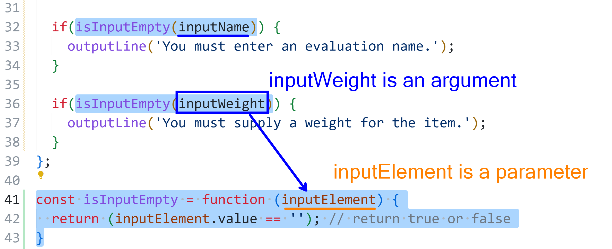
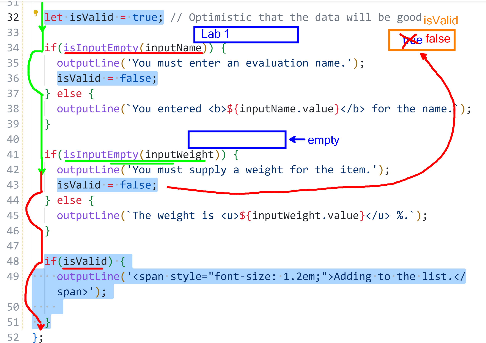

# If-Else & Debugging 

> Review the [**LOGs**](./LOGs.md) for this class.


## Demo-Grammar 

> *Relational and Logical Operators are also documented in the [demo-grammar](demo-grammar/index.html) sample. Use this sample as a "blank" page for ad-hoc exploration in the browser console.*

### If-Else Statements

The If-Else statement follows this grammar:

```js
if(conditionalExpression)
    statementOrStatementBlock
else
    statementOrStatementBlock
```

where the `conditionalExpression` is some expression that will result in a true or false value, and the `statementOrStatementBlock` is either a single instruction/statement or a set of statements inside curly braces (statement block).

### Relational Operators

Relational operators do a comparison between two items (the LH or "Left-Hand side" and the RH or "Right-Hand side"). All relational operations return a result of `true` or `false`.

-   **`==`** — "is equal to" - equality operator
-   **`===`** — "is equal to" - identity operator
-   **`!=`** — "is not equal to" - equality operator
-   **`!===`** — "is not equal to" - identity operator
-   **`>`** — greater than
-   **`<`** — less than
-   **`>=`** — greater than or equal to
-   **`<=`** — less than or equal to

### Logical Operators

Logical Operators do a comparison between boolean values for `&&` and `||` operators. The *unary* operator for "NOT" (`!`) will flip a true into a false and a false into a true.

-   **`&&`** — "AND" operator - both sides must be true to get a true result
-   **`||`** — "OR" operator - only one side needs to be true to get a true result
-   **`!`** &mdash: "NOT" operator - inverts the true to a false and the false to a true

----

## Class Notes

The opposite of `>` is `<=`. Think of a number line.


Don't mistake the assignment operator for the equality operator.


Re-usable functions are very helpful! You declare the function with whatever parameters (if any) you want, and then you **call** the function sending in *arguments*.



If-Else provides a way to control the **flow of execution** of your code during run-time.



----

## Demo-Trees 

> *Illustrates using if-else to control "toggling" the display of an item.*

----

## Demo-Thumbnails 

Work through the resize_thumbnails examples, which cover the following:

1. One event handler for multiple elements
2. Reducing unnecessary variables and event propagation and reducing unnecessary adding of event listeners
3. Removing the decision making from the solution and using what is known in the HTML
4. Converting to an anonymous function (and the why and when to do so)

----

## Demo-Debugging 

- Demo Debugging in Chrome
- Demo Debugging in VS Code
 
<!-- -->
